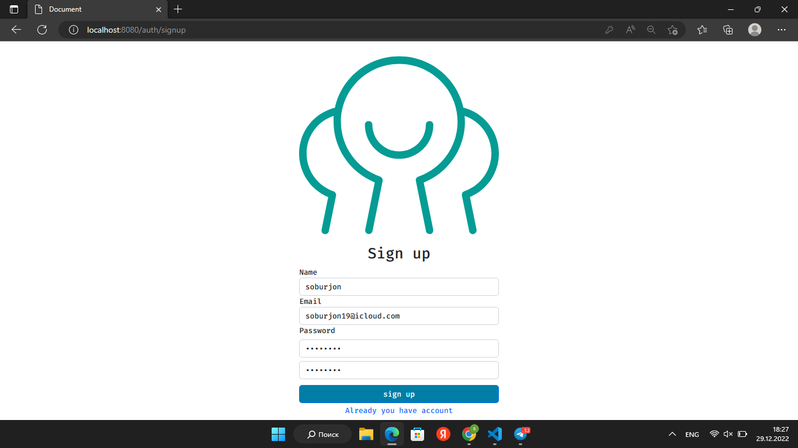
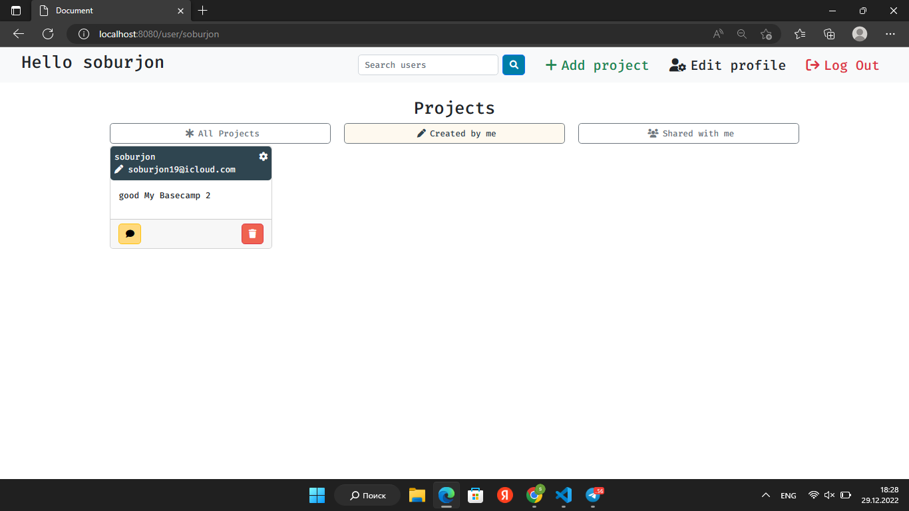
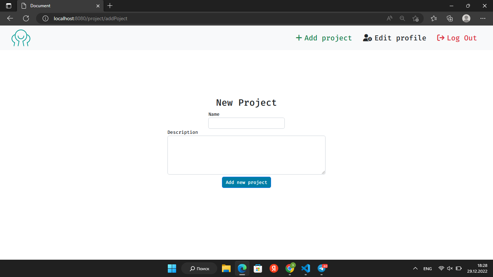
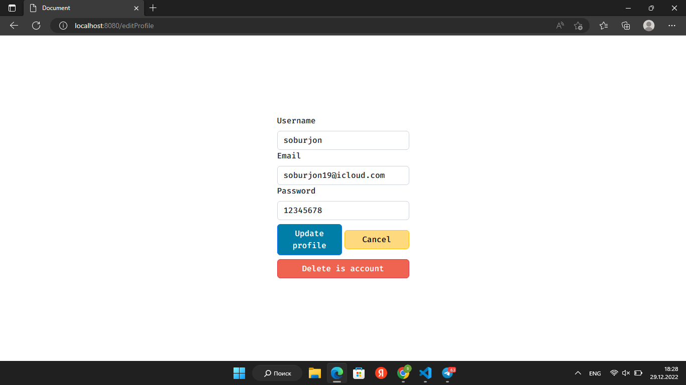
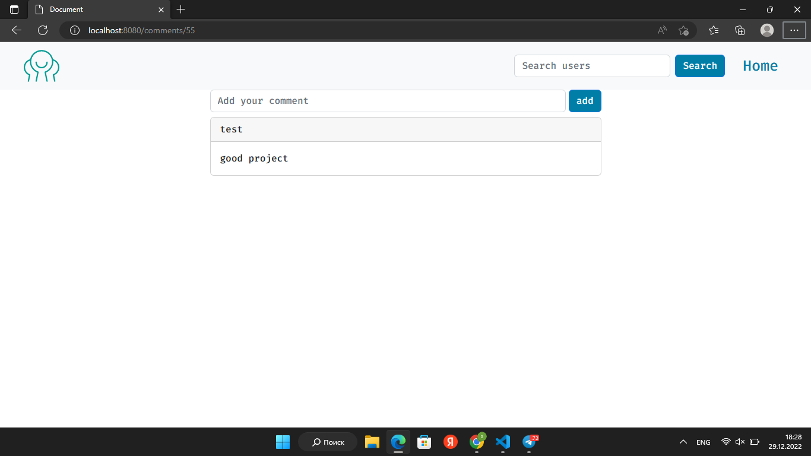
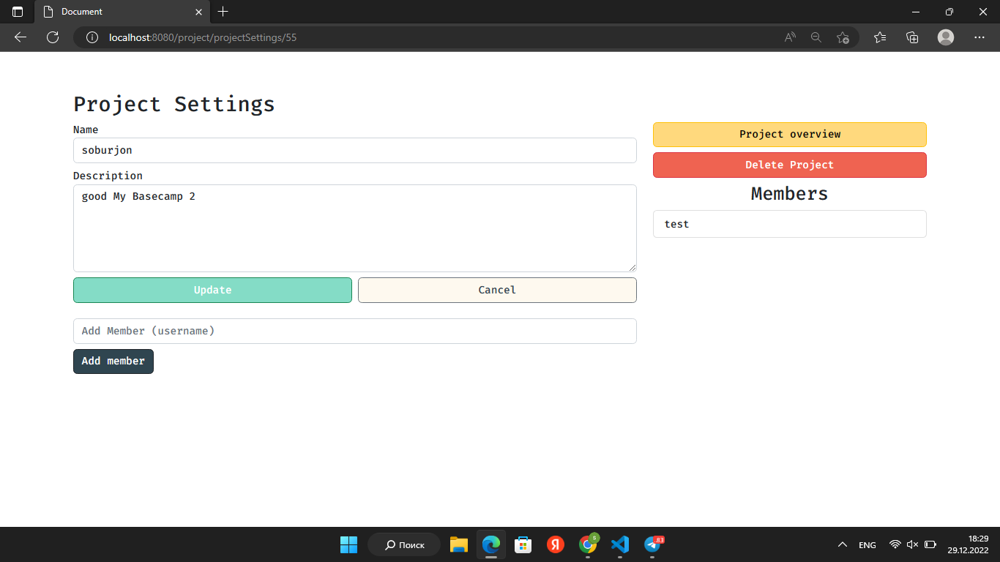
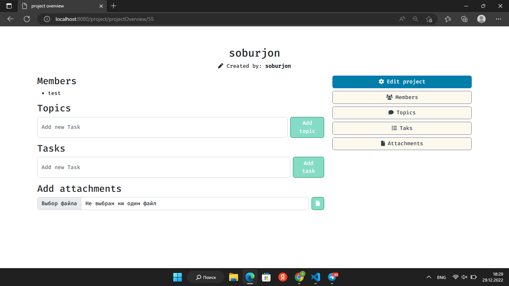

# Welcome to My Basecamp 2
Expressjs & sqlite3 project


### install this project
```
npm install && npm i nodemon -g
```

### Running server for development
```
npm start dev:start
```
### Or run server for review
```
npm start
```
# Abilities 
<ul>
  <li>Login</li>
</ul>

<ul>
  <li>Sign up</li>
</ul>

<p>If you don't have an account, you can create one.</p>
<ul>
  <li>Home</li>
</ul>

<ul>
  <li>Add Project</li>
</ul>

<ul>
  <li>Edit Profile</li>
</ul>

<ul>
  <li>Comments</li>
</ul>

<ul>
  <li>Project settings</li>
</ul>

<ul>
  <li>Project overview</li>
</ul>

